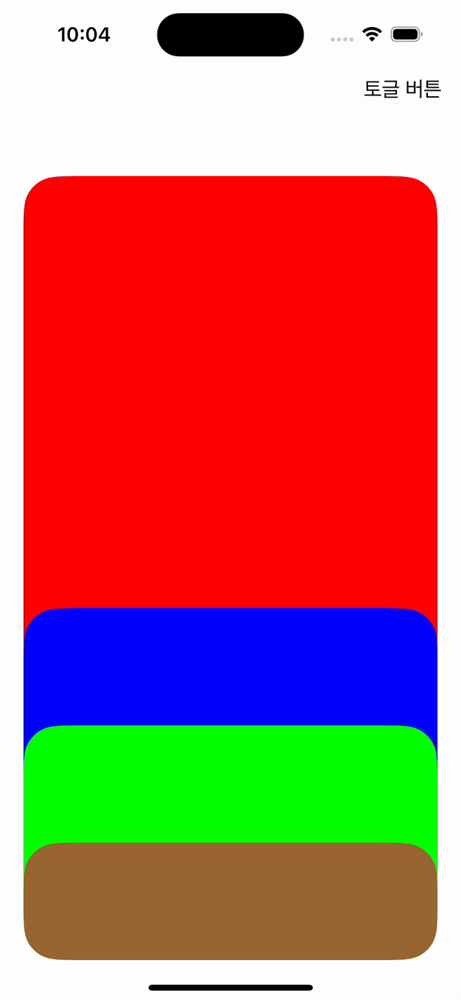

## CommonUI

이 모듈은 화면에서 재사용되는 **UI 컴포넌트**를 담는 곳입니다.

- `BaseViewController`, `BaseNavigationViewController` 와 같이 화면 공통 베이스 클래스
- `UnfoldListView` 와 같이 재사용 가능한 커스텀 뷰 / 컨트롤

> 규칙  
> - **화면 단위 컴포넌트/컨트롤**은 여기로  
> - UIKit 자체 기능 확장은 `UIExtensions` 로, 순수 헬퍼/유틸은 `UIUtility` 로 보냅니다.

### UnfoldListView

